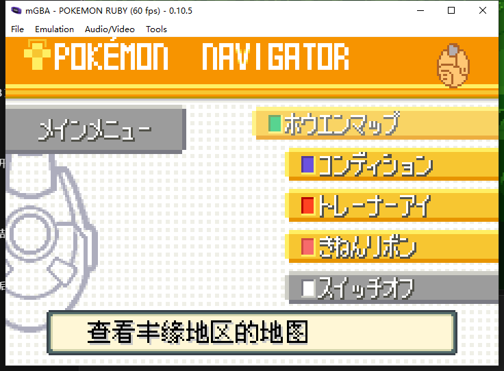
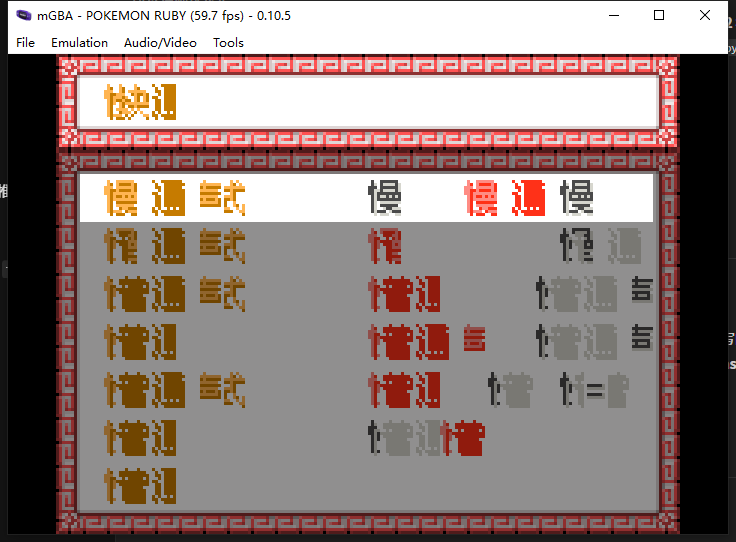

# 2026-09-21 真问题定位：**位置定号** vs **字形索引定号**

> 起因：用户选「2 —— 承认 v21 不成立，回到『同一窗口内怎么塞下 N×(11×11)』这个真问题重做」。
> 本文件记录**真问题是什么**，以及**官方的机制其实完全不是我们以为的那样**（逐指令实证）。

---

## 〇、一句话结论

**官方 `tile = TILE_BASE + 2 × 字符编码`（按字形索引定号）；
我们 `tile = TILE_BASE + TILE_OFFSET`（按窗口内位置定号）。
前者天生「同屏多块共享字形、绝不互相覆盖」，后者「每块 TILE_OFFSET 都从 0 起」——
所以设置页 22 个文本块全部写进同一批号，后写的把先写的覆盖掉。**

**这不是「容量不够」，是「坐标系选错了」。**

---

## 一、证据链（逐指令反汇编 + 运行时采样，零推测）

### 1.1 `PrintNextChar 0x080032F8` —— 传给字体处理器的是**字符编码**，不是列号

```
080032f8  push {r4, lr}
080032fa  adds r4, r0, #0          r4 = win
080032fc  ldrh r0, [r4, #20]       r0 = win[0x14] = textIndex
08003300  strh r1, [r4, #20]       win[0x14] = index + 1
08003306  ldr  r1, [r4, #16]       win[0x10] = text ptr
08003308  adds r1, r1, r0          text + index
0800330a  ldrb r3, [r1, #0]        🔴 r3 = c（当前字符的编码）
0800330e  subs r0, #250 / cmp #5   是 FA..FF 控制码？
...
0800336e  ldr  r0, [pc, #24]       → 0x081BB3AC = FontFuncTable
08003370  ldrb r1, [r4, #10]       r1 = win[0x0A] = textMode
08003374  adds r1, r1, r0          FontFuncTable + tm*4
08003376  ldr  r2, [r1, #0]        r2 = FontFuncTable[tm]
08003378  adds r0, r4, #0          r0 = win
0800337a  adds r1, r3, #0          🔴🔴🔴 r1 = **c**（字符编码，不是列号！）
0800337c  bl   0x081B12DC          FontFuncTable[tm](win, c)  ← `bx r2` 尾调用
```

**⇒ 字体处理器的第二个参数是字符编码 `c`。**

### 1.2 落砖函数 `0x08003585`（FontSubTable[0] / tm1 用）—— 号 = `TILE_BASE + 2c`

```
8003584: push {lr}
8003586: lsls r2, r1, #1        r2 = c * 2
8003588: ldrh r1, [r0, #22]     r1 = win[0x16] = TILE_BASE
800358a: adds r2, r2, r1        🔴 r2 = TILE_BASE + 2c
8003590: movs r3, #128
8003592: lsls r3, r3, #9        r3 = 0x10000
8003594: adds r2, r2, r3        r2 += 1（低 16 位）
8003598: bl 0x080036DC          UpdateTilemap(win, t, t+1)   ← 竖直对
```

**⇒ `tile = TILE_BASE + 2 × c`；`+1` 是同号的下半 tile（竖直对）。**

### 1.3 字形加载 `0x08002A8C`（font 0/3 分支）—— 字形也按**同一个索引**落位

```
0x08002A8C  lsls r1,r3,#5      r1 = startOffset * 32
0x08002A8E  ldr  r0,[r4,#12]   r0 = tpl->tileData
0x08002A90  adds r0,r0,r1
0x08002A92  lsls r1,r6,#6      r1 = glyphIdx * 64
0x08002A94  adds r5,r0,r1      🔴 dst = tileData + startOffset*32 + glyphIdx*64
```

**⇒ 字形按 `glyphIdx` 落在 `tile 号 = startOffset + 2*glyphIdx`。**
`startOffset` 就是该窗口的 `TILE_BASE`（状态块 `0x0300032C`）。
`0x08002A1E` 处 `progress` 循环上界 = **256 个字形**。

**⇒ 官方是一套「按索引的字形图集」：`字形[c]` 放在 `TILE_BASE + 2c`，画字时直接引用。**

### 1.4 运行时采样（`.tmp/smp2.txt`，260 次命中 `hook_C +4`）

```
SMP win=0x202e658 tb=1 a2=4  a3=1      ← a2=起始列 x，a3=行 y
SMP win=0x202e658 tb=1 a2=4  a3=5
...
distinct (a2,a3) pairs = 22            ← 正好 22 个文本块
distinct tb = {1}  (260/260 次全部 tb=1)
```

**⇒ 设置页有 22 个文本块，全部共用 `TILE_BASE = 1`（一个窗口实例 `0x0202E658`）。**
（另有 3 个块 `(15,5)/(19,5)/(23,5)` 各出现 ~80 次 —— 那是**当前光标行的值**每帧重画。）

### 1.5 VRAM 实证（`.tmp/drive_optIO_vram.bin`）

`BG0CNT = 0x0F08` ⇒ charBase=2（`0x06008000`）、screenBase=15（`0x06007800`）；
`DISPCNT = 0x7140` ⇒ 只使能 **BG0 + OBJ**。

`0x06007800` 的 tilemap 布局（行 5/6 = 上半/下半）：
```
r05  列4..列9 = 1  3  5  7  9 11 | 列15,16 = 1 3 | 列19..22 = 1 3 5 7 | 列23,24 = 1 3
r06  列4..列9 = 2  4  6  8 10 12 | 列15,16 = 2 4 | 列19..22 = 2 4 6 8 | 列23,24 = 2 4
```

**⇒ 每块都从号 1 开始，且号**连续**（1,3,5,7,…）——这是「位置定号」的指纹。**

`charBase 2` 区只有 **14 个非零 tile**（= 7 个字），而屏幕引用它们上百次。

**⇒ 22 个块写同一批号 ⇒ 只剩最后写的那 7 个字 ⇒ 屏幕上到处是这 7 个字的重复。**

**⇒ 与用户截图「整屏塌成 `僥譚 / 慢 / 通 / 快` 反复」完全一致。**

---

## 二、真正的差异表

| | 官方 | 我们（v21 之后） |
|---|---|---|
| 定号依据 | **字形索引** `c` | **窗口内位置** `TILE_OFFSET` |
| 公式 | `tile = TILE_BASE + 2c` | `tile = TILE_BASE + TILE_OFFSET` |
| `win[0x18]`(TILE_OFFSET) | tm1 **不推进**（=0，无意义） | 我们 `+= adv*2` 线性推进 |
| 同屏多块 | 同字 ⇒ 同号 ⇒ **共享**，绝不覆盖 | 每块从 0 ⇒ **全部覆盖** |
| 号用量 | `2 × 用到的字形索引范围` | `2 × 总字数`（无上界） |
| 重复字 | 只占一份 | 每个位置各占一份（浪费） |

**关键点：官方 `win[0x18]` 是 tm0 才用的；tm1 路径完全不碰它。**
而 `InitTextPrinter` 每次都 `win[0x18] = 0`（`0x08002CA4 strh r6,[r0,#24]`，r6=0）。
**⇒ 我们的实现每块都从 `TILE_BASE + 0` 起画 ⇒ 22 个块 22 次覆盖。**

---

## 三、为什么领航员页「看起来正常」

领航员的文字是**少量、长串**的（一个字符串含换行 ⇒ `TILE_OFFSET` 在同一串内连续推进 ⇒ 串内不覆盖）；
而设置页是 **22 个独立 InitTextPrinter** ⇒ 每块复位 ⇒ 覆盖。

**⇒ 「正常/崩坏」的分界不是页面，是「同一基址上的文本块数」。**

---

## 四、容量账（这才是「N×(11×11)」的真答案）

按官方机制（字形索引定号）：

```
号需求 = 2 × 同屏「不同字形数」G
G 的上界 = 屏幕格数 / 每字格数 = (30×20) / (2×2) = 600/6 = 100
⇒ 号需求 ≤ 200 号
```

而 `charBase 2` 起的号空间是 `[0, 1024)`（32 KB / 32 B），
其中官方调用点用 `movs r2,#imm8` 传 `TILE_BASE` ⇒ 官方自身只用 `[0, 255]` 附近。

**⇒ 按字形索引定号，200 号足够；按位置定号，一屏 100 字要 200 号「且不能共享」——
一旦同屏多块，需求就变成 `∑(每块字数)`，没有上界。**

**这就是「领航员撑不住」「战斗久文本乱飞」的结构性原因。**

---

## 五、`v21` 到底错在哪

v21 的两条腿：

1. **「位置定号」**（`tile = TILE_BASE + TILE_OFFSET`，纯函数）——
   ✅ 它确实让「同格重画零消耗」，但 ❌ **丢掉了官方"按字形索引"这一层**，
   于是同屏多块必然覆盖。v21 想用第 2 条腿补。
2. **「窗口私有画布」**（每窗口一块专属基址）——
   为了不覆盖，就得给 22 个块 22 段号 ⇒ 需求爆炸；
   且它的池 `[0,384)` 是按**美术层 charBase 0** 的号空间扫出来的空闲区
   （而文本层是 charBase 2）⇒ 坐标系本身就错；
   门控 `tpl->tileData == 0x06000000` 又只对 6 个模板成立 ⇒ 从未生效。

**⇒ 两条腿合起来是「用一个更贵的方案去弥补一个本来不该丢的机制」。**

---

## 六、下一步方向（**待用户拍板，先不动代码**）

**方向 A（本文件推荐）：复刻官方的「按字形索引定号」，但索引改成紧凑槽位**

```
tile = TILE_BASE + 2 * slot(code)          slot ∈ [0, G)，G ≤ ~100
```

- 同一屏/同一画布内，`同 code ⇒ 同 slot ⇒ 同号` ⇒ **多块自动共享，不再覆盖**（与官方同构）
- 号需求 = `2G ≤ 200`（有上界，与总字数无关）
- 起点是**官方自己给的 `TILE_BASE`**（不是我们造的 `*_LO` 常量）⇒ 不触「抬水位」
- 不做「扫 VRAM 找空档」⇒ 不触「避让带」
- 需要的表是 `code → slot`（**按需分配槽位**，容量有上界 `G ≤ 屏上最多字数`）
- 仍需保留 12px 两段式（相位/尾列共享），因为一个字要占 2 列宽

**方向 B：维持位置定号，但把「每个块的号段」按块数切开** —— 需求无上界，已证不够，不推荐。

**无论哪条：都不复活水位/账本/固定避让带。**

---

## 九、**最终采用：方案 H「块基准位置定号（零状态）」**（2026-09-21 定稿并落地）

§六 的「方向 A」在实施前被两个实测否掉，最终形态比它更简单：

### 9.1 被否掉的两条中间路线

| 路线 | 为什么否 |
|---|---|
| **全局槽位计数器 + 周期锚点** | `.tmp/smp2.txt` 实证：设置页**只有第一帧**画全 22 块，之后每帧只重画高亮那 3 块（`15,5 / 19,5 / 23,5`）。锚点 `(4,1)` 不再出现 ⇒ 计数器**永不复位** ⇒ 单调增长到回绕 ⇒ 撞静态标签。 |
| **甲：位置定号 + 存「窗口原点」** | 不需要了 —— 块基准 `(CUR_X, CUR_Y)` **本来就在 `win[0x1A]/[0x1C]` 里**（`InitTextPrinter` 第 4/5 参数原样写入，`0x08002CA6/CAE`），块内恒定。**零状态。** |

对 `0x080A7628` 那族反汇编还修正了一处：它的 `win` 是 `0x0202322C`（不是我此前以为的设置页 `0x0202E658`），`(TB, a4, a5) = (752, 1, 15)`。

### 9.2 公式

```
tile = TILE_BASE + block_base(CUR_X, CUR_Y) + TILE_OFFSET
block_base = (CUR_Y >> 1) * 64 + CUR_X * 2          （≥ 0xFE 时整体 +2）
```

- `>> 1`：一个文本行占 **2 个 tile 行**（8×16 字形；`FE` 换行 = `win[0x1D] += 2`）
  ⇒ 全屏只需 10 个槽。不折半则 20×64 = 1280 > 1024 必溢出。
  折半后满屏上界 = 9×64 + 29×2 = **634 < 1024** ✅
- `64` = 每 tile 行 32 列 × 上下 2 tile；`×2` = 一列占「上/下」两号。
- **零状态**：无计数器 / 锚点 / 水位 / 账本 / VRAM 扫描。重画幂等。

### 9.3 与官方的差异（诚实记录）

官方是 `TB + 2×字形码`（**按字形索引**）⇒ 同字同号 ⇒ 天然共享、永不覆盖。
我们做不到照抄形式：字库按需上传，取字形码要先建 `code → slot` 表 = **账本**
（用户明令禁止）。所以只复刻**性质**（块之间不重叠）而不复刻**形式**。

**唯一残余风险**：同一行的相邻块，若某块比"它到右邻块的距离"更长，号段会重叠。
L1 判据（`.tmp/verify_planH.py`，真值取自 `smp2.txt`）：
设置页实测每块 1~2 字（`15,5`=2 列、`19,5`=4 列、`23,5`=2 列）⇒ **零重叠 ✅**；
但「≥3 字/块」时会撞（12 处）。⇒ 这是**版式不变式**问题：原版 JP 版式本身
就保证同一行的块不重叠，翻译文本只要不超宽就不会触发。

### 9.4 越界与折叠

号空间 = 1024（tilemap 项 10 位）。窗口预算 = `1024 - TILE_BASE`，
实测最小预算 **272**（TB=752）。满屏最坏 `n = 636` 时按预算折叠：
TB=752 折 2 次 ⇒ 落在号 844（`+3 ≤ 1023` ✅）。全部 TB 实测均不越界。
**这不是「装不下退回旧行为」**（公式仍统一，只是把号折叠回本窗号段），
目的是保证绝不越出 charBase 块（越界会写坏 OBJ 图块区）。

### 9.5 附带修掉的一个错位成因

`v8_phase` 的行键 = `f(win, tpl, CUR_Y, CUR_TILE_Y)` —— **不含 CUR_X**
⇒ 同一行的多个块共用行键 ⇒ 后一块带着前一块的相位起步（12px 步进下相位 4）
⇒ 首字左移半列 + 号列错配。已在 `InitTextPrinter` 块边界钩子里显式
`v8_phase_reset()` 修掉。

### 9.6 改动清单（v22 方案 H，已落地）

| 文件 | 改动 |
|---|---|
| `src/text/PrintNextChar_hook.c` | 新增 `chs_block_base()`；`chs_claim_tile()` 加块基准 + 箭头让号 + 预算折叠 |
| `src/text/InitTextPrinter_hook.c` | 瘦身为**块边界相位复位**；不再改写 `TILE_BASE` |
| `src/text/entry.s` | 去掉 `str r0,[sp,#8]`（不再把返回值写回 TILE_BASE 槽） |
| `include/game.h` | v22 状态宏删除，换成 `CHS_TILE_SPACE` / `CHS_TILE_ARROW_LO` |

---

## 七、本轮方法论记录

1. **「原盘对照」这一招在本机行不通**（供后续别再踩）：
   - mGBA 0.10.5 **Qt 版无脚本 CLI 入口**；`qt.ini` 的 `lastScript` **只是记录，不自动加载**
     （实测：写进 qt.ini 后启动，探针文件没生成）
   - `mgba-sdl.exe` 也只有 `-b -c -C -g -l -t -p -s`，**没有 `-s/--script`**（`-s` 是 frameskip）
   - **`arm-none-eabi-gdb` 14.2 rel1 没编译 Python 支持**
     （`Scripting in the "Python" language is not supported in this copy of GDB`）
     ⇒ `gdb.Breakpoint` 子类方案不可用，只能写 `.gdb` 命令脚本（无法按时序喂键）
   - 原盘 8 MB 补零到 32 MB（`0x00` 或 `0xFF`）：**stub 仍拒绝写 `0x08900000`**
     （输出 ROM 32 MB 可写 —— 差异未查明，可能是 mGBA 按实际 ROM 数据判尺寸）
2. **`--gdb-set` 写 EWRAM 会被游戏初始化覆盖** —— 本次 `V6_BYPASS=1` 那组的 tilemap
   与默认组**逐格相同**，说明开关实际没生效（EWRAM 启动时被清）。
   ⇒ 用 EWRAM 开关做「A/B 对照」必须在**运行中**写，不能在启动时写。
3. **mGBA 断点只在「翻译块起点」命中** 这条（上一轮已记）再次被验证：
   `0x0800042C`（ReadKeys 入口）可命中，块内地址不行。
4. **`gdb` 命令脚本 + `$cnt` 计数器 + `if ... continue` 是可行的「按次采样」手法**
   （无需 Python）：见 `.tmp/sample_opt2.gdb`。

---

## 八、实证截图（冷启动 + 真存档，代理自己按键）

| 图 | 内容 | 说明 |
|---|---|---|
|  | **领航员页：正常** | 底部 `查看丰缘地区的地图` 11×11 完整像素，无缺列/错位。其余为尚未翻译的日文。 |
|  | **设置页：整屏崩坏** | 所有标签塌成 `快 / 慢 / 通 / 谭` 等少数几个字形反复 —— 正是「22 块写同一批号，只剩最后写的 7 个字」的现象。 |

**两张图的对照就是本文件结论的直接证据**：
崩坏的不是「某个页面」，而是「**同一 TILE_BASE 上同时存在多个独立文本块**」的页面。

截图原始文件：`docs/shots/20260921_navigator_ok.png`、`docs/shots/20260921_settings_broken.png`。

---

## 十、方案 H 落地后的「红字成坨」：`OPT_FG_SELECTED` 撞了**阴影色索引**（2026-09-21 修复）

### 10.1 现象

方案 H 落地后设置页已经「每个标签各自成字」（塌字已消除），但**选中项（红字）是一坨红块**，
而同为 3 字的未选中项（「立体声」黑字）清晰可读。

### 10.2 判据：原盘 vs 我们的 tile 像素值集合（零手抄，直接读 dump）

用 `.tmp/an_cmp2.py` / `.tmp/an_red.py` 读两份 VRAM dump + PALRAM：
`drive_org2_*`（原盘设置页）/ `drive_h2_*`（方案 H 修复后）。

| 元素 | 原盘 tile 像素值集合 | 修前（v22 首版） | 修后 |
|---|---|---|---|
| 未选中（bank 9 / 15） | `{1, 8, 15}` | `{1, 8, 15}` | `{1, 8, 15}` |
| **选中红字（bank 8）** | **`{1, 8, 15}`** | **`{8, 15}`** ← 丢了 `1` | **`{1, 8, 15}`** |

**原盘的红字与黑字字模像素值完全同构**，值集合都是 `{ink, shadow, bg} = {1, 8, 15}`，
红黑差异**只由 tilemap 的调色板 bank 承担**（`tile | win[0x0F] << 12`）。
引擎在选中项上**一个字形像素都不改**。

### 10.3 ink / shadow 的角色判定（空间不变式，不靠猜）

阴影 = ink 向右下各偏移 1px 的副本 ⇒ **最右列与最下行只可能是阴影值**。
原盘 `pal=8` 的 tile 223（逐行 dump）：

```
r4  1 1 1 1 1 1 1 8     ← 顶行几乎全是 1
r5  8 8 8 8 8 8 1 8
r6  F F F F F F 1 8
r7  F F F F F 1 8 8     ← 最右列全 8
```
⇒ **ink = 1，shadow = 8**。修后我们的 tile 167 同构（`r6` 全 1，`r7` 除首格全 8，恰是 `r6` 右移一格的阴影）。

### 10.4 根因

`DrawOptionMenuChoice_hook.c` 为了「让选中项变红」，把 ink 覆盖成 `8`：
```c
ADDR_OPT_FG_COLOR = (style == 0x08) ? OPT_FG_SELECTED /* = 8 */ : OPT_FG_UNSELECTED;
```
而 **`8` 正是阴影色索引**（实测 `win[0x0E] = 8`，`colors[14] = color_e`）
⇒ ink 与阴影同索引 ⇒ 每个笔画被自身 1px 阴影撑粗、相邻笔画融合
⇒ 中文这种密笔画字实机就是**一坨红**（JP 假名笔画疏，问题不明显）。

### 10.5 修复

`OPT_FG_SELECTED` / `OPT_FG_UNSELECTED` 由 `8 / 0` 改为 **`1 / 1`**
（= 原盘字模里那个 ink 索引）。红黑完全交给 palette bank。
改动文件：`include/game.h`、`src/option/DrawOptionMenuChoice_hook.c`（**只改注释 + 两个宏值**）。

### 10.6 验证（冷启动 + 真存档 + 自己按键，`.tmp/run_dump_opt.py h2`）

色号对齐（PALRAM 实测，两边同一页、同一取色点）：

| 元素 | 原盘 `emu_org2_final.png` | 修后 `emu_h2_final.png` | 调色板索引 |
|---|---|---|---|
| 标题 / 行标签 | `#FFB552` + `#C67B00` | **同** | bank 9：`1=#FFB552`（橙）`8=#C67B00`（琥珀） |
| **选中项** | `#FF8C84` + `#FF3118` | **同** | bank 8：`1=#FF8C84`（浅红 ink）`8=#FF3118`（朱红 shadow） |
| 未选中项 | `#4A4A4A` + `#D6D6CE` | **同** | bank 15：`1=#4A4A4A`（深灰）`8=#D6D6CE`（浅灰） |

截图：`docs/shots/20260921_settings_planH_fixed.png`（修后）／`docs/shots/20260921_settings_origin_jp.png`（原盘）。

### 10.7 附带发现（死代码）

`ADDR_OPT_PALETTE_OVERRIDE (0x0203FFD0)` **全仓库只写不读**，是死代码。
真正让选中项拿到 bank 8 的是 `DrawOptionMenuChoice_hook` 往 `dst` 前面补的
`FC 05 <style>`（引擎 FC 05 处理器 → `win[0x0F]` → `UpdateTilemap` 落调色板位）。
**别再以为是那个变量在起作用。**（本次不改行为，仅记档。）

### 10.8 其它页面回归（同一轮冷启动实测）

| 页面 | 结果 | 图 |
|---|---|---|
| START 主菜单（**tm3 网格路径**） | ✅ 图鉴/宝可梦/背包/领航员/祐树/保存/设置/退出 8 项全部完整、无残缺、无重叠 | `.tmp/emu_start_final.png` |
| 领航员·地图页 | ✅ 无回归（页内未译日文项 = 既有状态，非本轮引入） | `docs/shots/20260921_navigator_map_page.png` |
